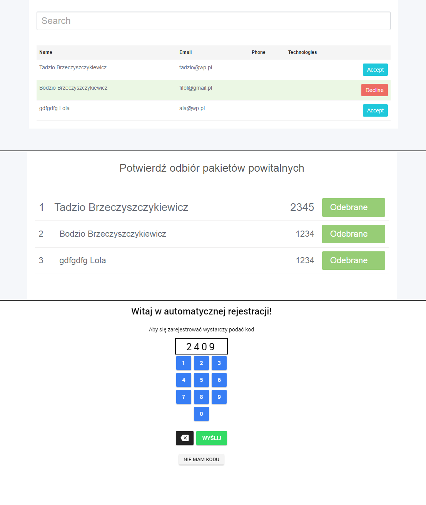

# pgs-hackaton
PGS Hackaton!

Company's event manager - Angular 2 / Express / MongoDB

## Server (Express + mongoose)
# install dependencies
go to `server` directory
`npm install`
`npm run start` will run Express server listening on port `3000`

### Endpoints

Jeden endpoint `ws://adres_ip:3000/`

### Zapytania

List eventów:

`{
  "method": "getEvents"
}`

Szczegóły eventu:

`{
  "method": "getEvent",
  "params": {
    "id" : "571b3c2459ce5d5020a9af60"
  }
}`

Pobranie member po kodzie:

`{
   "method": "retrieveByCode",
   "params": {
     "code" : 3133
   }
 }`

Dodaawanie member do event:

```
{
   "method": "addMember",
   "params": {
     "event_id": "571b3c2459ce5d5020a9af60",
     "member" : {
       "email": "bio@wp.pl",
       "last_name": "Brzeczyszczykiewicz",
       "first_name": "Bodzio",
       "code": 5465,
       "gifted": false,
       "registered": true
     }
   }
 }
 ```

## Client (desktop app in Angular2)
# install dependencies
go to `client-desktop` directory
`npm install` to install dependencies
`npm run start` will run webpack-dev-server with
go to `localhost:4000` to view app

## Tablet (tablet app in Ionic2)
# install dependencies
go to `client-tablet` directory
`npm install` to install dependencies
`npm install ionic@beta -g` to install global ionic package
'ionic serve' will run application




